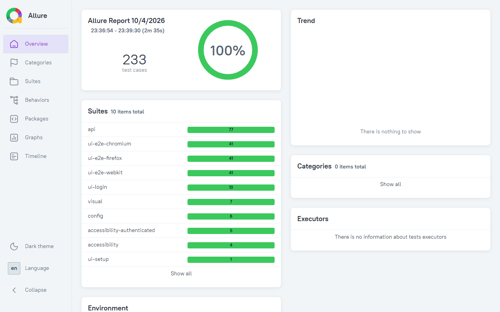

# QA Automation Portfolio — Playwright + TypeScript

[](https://github.com/lodmaome/playwright-qa-portfolio/actions/workflows/playwright.yml)
[](https://playwright.dev)
[](https://lodmaome.github.io/playwright-qa-portfolio/)

A full-stack test automation suite targeting a production-grade e-commerce app
([SauceDemo](https://www.saucedemo.com)) and a REST API ([DummyJSON](https://dummyjson.com)).

## Coverage

| Layer | Tool | Spec files | Tests | Location |
|---|---|---|---|---|
| UI E2E | Playwright POM + fixtures | 7 | 142 runs (54 unique) | `tests/ui/` |
| API contract | APIRequestContext + Zod | 6 | 77 | `tests/api/` |
| Visual regression | Playwright snapshots | 3 | 7 | `*-visual.spec.ts` |
| Accessibility | axe-core (WCAG 2.1 AA, critical + serious impacts only) | 5 | 9 | `tests/accessibility/` |
| Config | Env validation | 1 | 6 | `tests/config/` |
| **Total** | | **22** | **241 runs (153 unique)** | |

The UI E2E count includes the login suite (10 tests, one browser) and the
authenticated suite (44 tests, run on Chromium, Firefox, and WebKit). Counts come
from `npx playwright test --list`, and the auth setup step is not in the table.

## Quick start

Requires Node 22 (pinned in `.nvmrc`).

```bash
cp .env.example .env      # fill in credentials — see .env.example for hints
npm ci
npx playwright install --with-deps   # --with-deps installs system libraries on Linux
npx playwright test       # all projects
```

For an environment that matches CI exactly (Linux, pinned browser versions,
no `playwright install` step needed), open this repo in VS Code with the
[Dev Containers](https://marketplace.visualstudio.com/items?itemName=ms-vscode-remote.remote-containers)
extension and Docker Desktop installed, then run "Dev Containers: Reopen in
Container". See [`.devcontainer/devcontainer.json`](.devcontainer/devcontainer.json).
The `.env` step above still applies inside the container — it's the same
project folder, not a copy.

**On Windows with Docker Desktop**, the first attempt may fail with
`accessing specified distro mount service: ... no such file or directory`.
This is the Dev Containers extension trying to forward a WSL GUI (Wayland)
socket that may not exist on your system, not a problem with the image or
the project. Add this to your VS Code user `settings.json` and retry:

```json
"dev.containers.mountWaylandSocket": false
```

**`node_modules` is shared with the host**, since the container mounts the
real project folder rather than a copy. Its `postCreateCommand` runs `npm ci`
inside Linux, which overwrites `node_modules` for Linux on disk. If you go
back to a plain Windows terminal afterward and commands like `npm run lint`
fail with something like `'eslint' is not recognized`, run `npm ci` again on
Windows to switch it back.

## Projects

| Project | What it runs | Needs auth? |
|---|---|---|
| `config` | Config loading and env validation (6 tests) | No |
| `ui-login` | Login page UI tests | No |
| `ui-setup` | Auth setup — writes `.auth/login.json` | — |
| `ui-e2e-chromium` | Authenticated UI suite on Chrome | Yes (depends on `ui-setup`) |
| `ui-e2e-firefox` | Authenticated UI suite on Firefox | Yes (depends on `ui-setup`)|
| `ui-e2e-webkit` | Authenticated UI suite on Safari/WebKit | Yes (depends on `ui-setup`)|
| `api` | API contract tests (DummyJSON) | No browser |
| `accessibility` | Unauthenticated a11y + keyboard nav | No |
| `accessibility-authenticated` | Cart + inventory a11y and keyboard operability | Yes |
| `visual` | Visual snapshot regression | Yes |

The three browser E2E projects intentionally exclude login-flow and visual
specs. Login behavior is covered by the dedicated ui-login project, while
visual regression runs through the visual project.

As a result, the direct login-flow suite is not repeated across Chromium,
Firefox, and WebKit. The cross-browser projects focus on the authenticated
UI flows.

Run a single project:

```bash
npx playwright test --project=api
npx playwright test --project=ui-e2e-chromium
npx playwright test --project=visual --update-snapshots   # refresh baselines
```

## Viewing results

```bash
npm run report:playwright   # built-in Playwright HTML report
npm run report:allure       # generate Allure report
npm run report:open         # open generated Allure report
```

The Playwright HTML report retains traces, screenshots, and videos for failed
tests. The CI workflow publishes the Allure report to GitHub Pages after each
push to `main`. Pull requests and other branches upload it only as the
`allure-report` artifact of the run.

Live Allure report: [lodmaome.github.io/playwright-qa-portfolio](https://lodmaome.github.io/playwright-qa-portfolio/)



## Docs

- [Architecture decisions](docs/ARCHITECTURE.md) — why the suite is structured the way it is
- [Test strategy](docs/TEST-STRATEGY.md) — naming conventions, POM pattern, fixture guide, skip vs fail
- [Environment setup](docs/ENVIRONMENT.md) — `.env` config, base URLs, multi-env and CI strategy
- [Bugs this suite has caught](docs/BUGS-CAUGHT.md) — real gaps found in the suite itself, with evidence and fixes
- [Flakiness measurement](docs/FLAKINESS.md) — repeated runs and real margins for the performance budgets

## CI notes

- **Fork pull requests** do not receive repository secrets, so the test run fails at
  config load with a clear missing-variable error. Outside contributions need a
  maintainer to run the suite from a branch in this repository.
- **Refreshing visual baselines:** run the `Update Visual Snapshots` workflow manually
  from the Actions tab. It regenerates the Linux baselines and uploads them as the
  `playwright-snapshots` artifact. Download the artifact, copy the `*-visual-linux.png`
  files into the matching `tests/ui/**/*-snapshots/` folders, and commit them.

## Known limitations

- **Performance budgets (TTFB/DCL/load, LCP)** — both performance tests assert hard
  millisecond thresholds against the live, third-party `saucedemo.com` over the real
  network, and the LCP test additionally reads a `PerformanceObserver` entry inside
  `page.evaluate()`. Both are sensitive to headless rendering speed and CI container
  CPU/network variance. Consider `test.skip(!!process.env.CI, "...")` on either if it
  proves flaky in practice. See [Flakiness measurement](docs/FLAKINESS.md) for data on
  how much headroom the budgets have.
- **Session expiry** — `storageState` is written once per run by `ui-setup`. If a very long
  run causes the session to expire mid-suite, authenticated tests fail with redirect errors.
  Re-running regenerates the token.

## Not covered

These are deliberate gaps in the current suite, listed so the limits are clear:

- **Cart quantity changes.** The UI cart tests cover adding and removing items.
  They don't change an item's quantity.
- **Persistence across sessions.** A page reload keeps the cart, but no test signs
  in again later to confirm it survives a new session. The API cart tests check the
  response to POST, PATCH, and DELETE only, because DummyJSON doesn't store writes
  (see the note in `tests/api/cart.spec.ts`).
- **Tax amount.** The checkout overview tests confirm that tax is a non-negative
  amount and that the order total equals the item total plus tax. They don't check
  the tax rate or the item prices.
- **Session expiry.** Covered under Known limitations.
- **Responsive and mobile layouts.** No test runs at a mobile viewport.
- **Accessibility depth.** axe-core checks only critical and serious impacts, so
  minor issues are not reported.

## Commit messages

This repo uses [Conventional Commits](https://www.conventionalcommits.org):

- `feat:` new tests or capabilities
- `fix:` corrections to tests, config, or the CI workflow
- `refactor:` restructuring with no change in behavior
- `test:` changes to test coverage only
- `docs:` documentation only
- `chore:` maintenance such as dependencies, licensing, or tooling

Example: `fix: correct lint alias so cartTest.only() is flagged`

Commits made before this convention was adopted don't follow it. The history
was left unchanged rather than rewritten.

## License

MIT — see [LICENSE](LICENSE). This covers the code in this repository only.
SauceDemo and DummyJSON are third-party services with their own terms.
